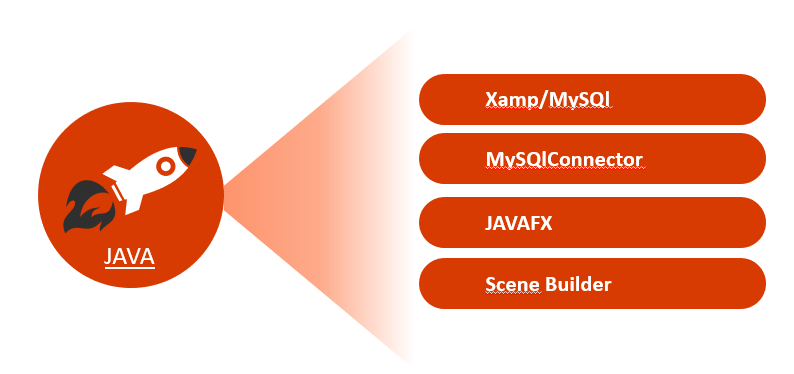

  

<h6 align="center">
  
</h6> 
 
<h1 align="center"> JAVA Application </h1>

<h2> * There are two profiles of people who can use this bank account managment application : </h2> 

- Bank officer  
- Bank customer  

<h2> * Officer role: </h2>  

- Customer Management Employee Management Account Management.
- Make withdrawals from an account.
- Make payments into an account.
- Transfer from one account to another.

<h2> * Customer role: </h2> 

- Consult your account Modify your information.
- Request a check book.
- Add a complaint.
- Consult the list of operations with the possibility of selecting a specific period.

<h2> About the application: (FR-fr) </h2> 

<h3 align="center"> ** Class Diagram ** </h3>   

<h3 align="center"> ** Use Case Diagram ** </h3>   

<h3 align="center"> ** Global application architecture  ** </h3>   

<h3 align="center"> ** Environment of development ** </h3>   
